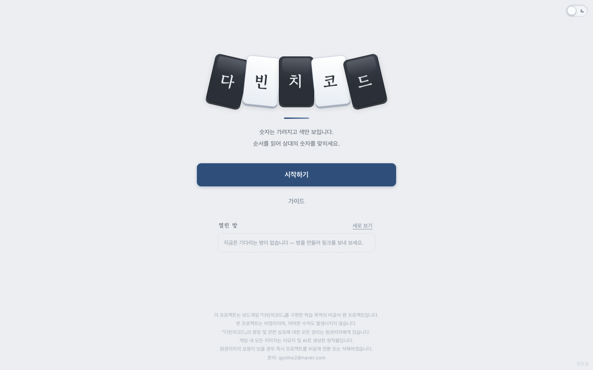

# 🧩 다빈치코드

  [](https://41ways.github.io/davinci-fanproj/) [](https://41ways.github.io/norara/)

숫자는 가려지고 색만 보인다. 순서를 읽어 상대의 숫자를 맞히는 다빈치코드.
방 코드나 초대 링크로 최대 4인이 붙는다. 온라인 판은 서버(Cloudflare Workers + Durable Object)가 심판을 맡고,
혼자 하기(봇과)는 서버를 거치지 않고 브라우저에서 돈다. 계정은 없다.



## 한눈에

| | |
|---|---|
| **종류** | 보드게임 · 온라인 |
| **인원** | 2~4인 (봇으로 채우면 혼자도) |
| **플레이** | **https://41ways.github.io/davinci-fanproj/** |
| **로컬 실행** | `npm install && npm start` → http://localhost:8876 |
| **한 줄 규칙** | 상대의 덮인 타일 숫자를 먼저 다 맞히면 이긴다 |
| **허브** | https://41ways.github.io/norara/ |

**목차** — [규칙](#규칙) · [조작](#조작) · [실행](#실행) · [대기실](#대기실) · [배포](#배포) · [통신](#통신) · [숨은 정보](#숨은-정보) · [파일](#파일) · [테스트](#테스트) · [알려진 제약](#알려진-제약)

## 규칙

- 타일 **26장** — 검정 0~11, 흰색 0~11, 그리고 **검정 조커 / 흰색 조커**.
- 손패는 **작은 수 → 큰 수** 순으로 놓인다. 같은 숫자면 **검정이 왼쪽**.
- **색은 뒷면에서도 보인다.** 가려지는 것은 숫자뿐이다.
- 시작할 때 **바닥에서 손패를 직접 골라온다** (2인 4장, 3~4인 3장)
- 자기 차례에 **바닥에서 한 장 집고**(색만 보고 고른다), 상대의 덮인 타일 하나를 지목해 값을 부른다.
  - **적중** — 그 타일이 공개된다. 이어서 한 번 더 맞힐지, 멈출지 고른다.
  - **빗나감** — 집은 타일을 공개해서 손패에 넣고 차례가 끝난다.
- 바닥이 비면 집지 않고 추측한다. 빗나가면 **자기 타일 하나를 스스로 공개**한다.
- 자기 타일이 전부 공개되면 탈락. 마지막까지 숫자를 지킨 사람이 이긴다.

### 조커

조커는 숫자가 없고 **손패의 어느 자리에나** 놓을 수 있다. 한 번 놓으면 움직이지 않는다.
맞히려면 숫자가 아니라 "조커"라고 불러야 한다.

판이 시작되기 전에 **모두가 시작 손패를 직접 고르는 단계**를 거친다.
바닥에서 색만 보고 정해진 장수만큼 집어오고, 조커가 나오면 원하는 자리로 옮긴 뒤 준비를 누른다.
바닥에서 무슨 색을 집어가는지는 **모두에게 바로 보인다**(검정 몇 장 · 흰색 몇 장).
다만 그것들을 **어떤 순서로 놓았는지는 준비를 누르기 전까지 비밀**이다. 준비를 누르면 배치가 공개된다.
가림막 뒤에서 정리하는 실제 게임과 같다.
조커가 없는 사람도 같은 단계를 거치므로
"저 사람이 자리를 고르고 있다 = 조커를 가졌다"가 드러나지 않는다.

조커를 지키기 위한 장치가 하나 더 있다. **집은 타일은 숫자든 조커든 항상 자리를 고르는 단계를 거친다.**
숫자 패만 자동으로 놓이면 "자리를 고르고 있다 = 조커를 들었다"가 그대로 드러나기 때문이다.
숫자 패는 순서에 맞는 자리가 밝게 표시되고, 다른 자리를 눌러도 맞는 자리로 붙는다.
밖에서 보면 두 경우가 구분되지 않는다.

## 조작

- 바닥의 타일을 눌러 한 장 집는다. 바닥은 **색끼리 묶여 정렬**되어 있다.
- 상대의 덮인 타일을 누르고 숫자(또는 조커)를 고른다.
- 놓을 자리를 고르면 손패가 벌어지며 타일이 끼어든다. 이 모션은 **모두에게 보인다**.
- `추론 보조` 를 켜면 순서상 불가능한 값이 흐려진다.

### 누가 무엇을 불렀는지

추측이 나오면 화면 위에 띠가 뜬다. **예측을 먼저 1초간 보여주고, 그 다음 결과가 나온다.**

```
봇 둘 → 봇 하나 2번째   [검정 0]   예측
                    ↓ 1초 뒤
봇 둘 → 봇 하나 2번째   [검정 0]   빗나감
```

예측이 뜨는 동안 판은 멈춰 있어서 결과가 미리 새지 않는다.
화면 윗부분은 이 띠의 자리로 항상 비워두기 때문에 알림이 떠도 판은 움직이지 않는다.
결과가 나오는 순간에는 화면 한가운데에 **적중 / 빗나감**이 크게 떴다가 사라진다.

**그리고 이 기록은 어디에도 남지 않는다.** 다음 차례가 되면 사라진다.
누가 무엇을 불렀는지 기억하는 것이 이 게임의 실력이고, 헷갈리거나 까먹으면 그만큼 불리해진다.

## 실행

```
npm install
npm start            # node server.js — http://localhost:8876
```

`server.js` 는 `public/` 을 정적 파일로 내주고 `/ws` 로 소켓을 받는 Node 서버다. 로컬 개발과 테스트용이고,
실제 서비스는 Cloudflare(`worker.js`)에서 같은 `game.js` 로 돈다. 데스크톱 Chrome 권장. 모바일 폭에 맞춰 만들었다.

타이틀에는 `시작하기` · 가이드 버튼과 **열린 방** 목록을 둔다. `시작하기` 를 누르면 고르는 화면이 나온다.

- **혼자 연습** — 봇 1~3명과. 실력 3단계. 서버를 거치지 않고 이 브라우저에서 판이 돈다.
- **방 만들기** — 4자리 코드가 나온다. 코드나 초대 링크로 친구가 들어온다. 비공개로 만들 수도 있다.
- **참가** — 코드를 넣거나, 타이틀의 열린 방 목록에서 고른다.

## 대기실

- **초대 링크 복사** — `?room=CODE` 주소다. 이 링크로 열면 고르는 화면에 코드가 채워져 있다.
- **열린 방** — 시작 전이고 자리가 남은 공개 방을 타이틀에서 6초마다 새로 본다. 누르면 코드를 채워 고르는 화면으로 간다.
- **비공개 방** — 만들 때 고르거나 방장이 대기실에서 켠다. 목록에 안 보이고 코드·링크로만 들어온다.
- **봇 추가 · 내보내기 · 봇 실력** — 방장만. 봇 실력은 방 설정이라 그 방의 봇 모두에 적용된다.
- **채팅** — 사람이 둘 이상이면 오른쪽 아래에 뜬다. 서버가 같은 방에만 돌려주고 저장하지 않는다.
  접어 둔 동안 온 말은 빨간 숫자 · 말풍선 · 탭 제목의 `(n)` 세 군데로 알린다.
- **새로고침** — 탭마다 자리표(`sessionStorage`)를 적어 두어, 새로고침해도 같은 자리 · 같은 손패로 돌아온다.
  같은 자리를 다른 탭이 이어받으면 먼저 탭은 쉬고(4001), 누르면 다시 가져온다.
- **방장이 나가면** — 끊긴 방장은 20초 기다렸다가 붙어 있는 사람에게 넘긴다. 그 안에 돌아오면 그대로 방장이다.
  모두 끊겼다가 먼저 돌아온 사람이 방장을 맡는다. 판은 방장과 상관없이 이어진다.
- **판 중에 끊기면** — 판이 그 사람을 기다리게 되면(그 사람 차례, 또는 시작 패 고르기·순서 패 뽑기) 20초 기다린다.
  돌아오지 않으면 탈락 처리하고 남은 사람끼리 계속한다. 판 위쪽 `나가기` 를 누르면 곧바로 빠진다.
- **판이 끝나면** — 방장이 `대기실로` 를 누르면 모두 대기실로 돌아간다. 한 페이지에서 계속 이어서 한다.

## 배포

Cloudflare Workers 무료 플랜. `wrangler.toml` 에 설정이 다 들어 있다.
화면 파일(`public/`)은 정적 자산으로, 소켓(`/ws`)과 상태 확인(`/healthz`)만 Durable Object 하나(`main`)로 간다.

```
./bump.sh              # 자산 URL 의 ?v= 를 내용 해시로 갱신
npx wrangler login     # 처음 한 번
npx wrangler deploy
```

무료 한도는 "객체가 켜져 있는 시간"이 먼저 찬다. 그래서

- 탭은 25초마다 ping 을 보내고, 2분 반 넘게 소식이 없는 소켓은 끊긴 것으로 친다.
- 20분 동안 아무 조작이 없는 소켓은 서버가 닫는다(4000). 화면은 아무 곳이나 누르면 다시 붙는다.
  대기실 자리는 이때 지우지 않는다(사람이 나간 게 아니라서).
- 방도 소켓도 없으면 청소 타이머까지 멈춰 객체가 잠든다. 혼자 하기를 누르면 방 목록용 연결도 내려놓는다.

`/healthz` 는 `{"ok":true,"rooms":N,"sockets":N}` 을 돌려준다.
옛 GitHub Pages 주소로 오는 사람은 저장소 루트의 `index.html` 이 새 주소로 넘긴다.

## 통신

**서버가 심판이다.** 판(바닥 · 손패 · 순서 패 · 차례)과 봇은 전부 `game.js` 가 쥐고, 규칙 판정은 `rules.js` 가 한다.
화면은 `{t:'act', action, args}` 로 하고 싶은 행동만 보내고, 규칙에 어긋나면 이유가 돌아와 토스트로 뜬다.
신원은 소켓이 정하므로 남의 차례를 가로챌 수 없다. 자리 번호 자리에 이상한 값이 와도 규칙 엔진에 닿기 전에 걸러낸다.

예전(PeerJS P2P)에는 **방장이 모든 패를 볼 수 있었다.** 이제는 아무도 못 본다 — 서버만 판을 쥐고,
사람에게 나가는 판 화면은 전부 `viewFor(s, 그 사람)` 을 거친다. 전체 상태를 보내는 길은 하나도 없다.

**혼자 하기는 브라우저에서 돈다.** 서버 한도를 아끼려고, 봇과 하는 판은 예전처럼 `app.js` 가 같은
`rules.js` · `ai.js` 로 직접 돌린다. 온라인 판과 같은 `applyView` 로 그리므로 판 화면 코드는 하나다.

연출(예측을 먼저 띄우고 결과를 잠시 붙잡아 두는 것)은 **화면 쪽 일이다.** 서버는 상태만 보내고,
봇이 다음 수를 두기 전에 예측을 읽을 시간(0.8초 + 글자당 0.07초, 최소 1.4초)만 쉰다.
부른 사람 말고 볼 사람이 없으면 0.65초만 쉰다. 선공이 정해진 뒤 판을 여는 것도 서버가 같은 식으로 뜸을 들인다.

### rules.js · ai.js 를 양쪽에서 쓰는 법

원본은 저장소 루트에 하나씩만 있다. 둘 다 끝에서 `module.exports` 가 있으면 그리로, 없으면 `window.Rules` · `window.AI` 로 내보낸다(UMD).

- 서버 — `game.js` 가 `require('./rules')` · `require('./ai')` 로 부른다. wrangler 가 묶을 때 그대로 따라 들어간다.
- 화면 — `public/rules.js` · `public/ai.js` 는 `../rules.js` · `../ai.js` 를 가리키는 **심볼릭 링크**다.
  Node 서버는 링크를 따라 읽고, wrangler 는 자산을 모을 때 링크를 따라가 원본 내용을 올린다. 복사본도 빌드도 없다.
  `test/smoke.js` 가 `/rules.js` · `/ai.js` 응답이 루트 원본과 글자 하나까지 같은지 확인한다 — 배포본에 대고도 돌려 볼 것.

## 숨은 정보

이 게임은 숨은 숫자가 전부다. 서버는 사람마다 이만큼만 보낸다.

| | 누구에게 보이나 |
|---|---|
| 내 손패 숫자 · 내 조커 자리 | 나만 |
| 남의 덮인 타일 | 색만 (정리 중이면 색도 안 보이고 "검정 몇 장 · 흰색 몇 장" 만) |
| 바닥 | 색과 장수만. 순서는 아무도 모른다 |
| 내가 집은 패 · 놓으려는 패 | 나만 (남에게는 "검정을 집었다" 는 색만) |
| 순서 패 | 내가 뽑은 숫자만. 다 뽑으면 한꺼번에 공개 |
| 빗나간 추측 | 부른 값만. 실제 타일은 안 보낸다 |

이벤트 두 가지는 `viewFor` 위에서 서버가 한 번 더 가린다(`game.js` 의 `viewOf`).

- **조커를 옮긴 것**(`setupMove`)은 본인에게만 상태를 보낸다. '누가' 를 지운 채로라도 보내면
  "방금 누가 조커를 옮겼다" 가 드러난다(준비 안 한 사람이 하나뿐이면 그 사람이다).
  남에게는 그 전 이벤트를 그대로 둔다.
- **시작 패를 끼운 자리**(`draft` 의 `index`)는 본인에게만. 자리 번호와 늘어난 색을 모으면
  준비 전 배치가 드러나고, 준비 뒤 배치와 견주면 조커를 옮겼는지까지 드러난다.

`test/flow.js` 는 사람 손님이 받은 **모든 메시지**를 모아 두었다가, 숫자가 실린 타일이
"내 것" 이거나 "이미 공개된 것" 인지 한 장씩 확인한다. 검사기 자체가 멀쩡한지도 따로 본다
(판 상태를 통째로 넣어 보고, 잡아내지 못하면 실패한다).

## 파일

| 파일 | 역할 |
|---|---|
| `rules.js` | 규칙 엔진. 순수 함수. 네트워크도 UI도 모른다 |
| `ai.js` | 봇. 보이는 정보만으로 후보를 좁힌다 |
| `game.js` | 방 관리와 온라인 판 진행. 통신 방식은 모른다 |
| `worker.js` | Cloudflare Worker + Durable Object. 소켓을 `game.js` 에 잇는다 |
| `server.js` | 같은 `game.js` 를 Node `ws` 로 띄우는 로컬 서버 |
| `wrangler.toml` | Cloudflare 설정. 자산 `public/`, `/ws` · `/healthz` 만 Worker 로 |
| `public/index.html` `style.css` `app.js` | 화면. 혼자 하기 진행, 온라인 연결 · 대기실 · 채팅 |
| `public/rules.js` `public/ai.js` | 루트 원본을 가리키는 심볼릭 링크 |
| `index.html` | 옛 GitHub Pages 주소를 새 주소로 넘기는 한 장 |
| `rules.test.js` `ai.test.js` | 규칙 · 봇 테스트 |
| `test/flow.js` `test/smoke.js` | 서버 시나리오 테스트 · 떠 있는 서버 확인 |

## 테스트

```
npm test                                   # 아래 셋을 차례로
node rules.test.js
node ai.test.js
node test/flow.js                          # 서버를 8876 에 DAVINCI_FAST=1 로 띄워 시나리오를 돈다
node test/smoke.js http://127.0.0.1:8876   # 떠 있는 서버(어느 것이든) 확인
```

- 규칙 엔진 **144개** — 덱, 놓을 자리, 조커, 시작 손패 고르기, 준비 전 배치 은닉, 탈락/승리, 정보 은닉,
  그리고 **무작위 500판 완주**(매 수마다 타일 26장 보존 / 정렬 유지 / 탈락자에게 차례가 가지 않음 검사)
- 봇 **3개** — 핵심은 두 가지다.
  - 후보 목록이 정답을 배제한 적이 **0회** (배제하면 봇이 맞힐 수 없는 값을 부르게 된다)
  - 후보가 하나로 좁혀졌을 때 틀린 적이 **0회** (추론이 논리적으로 건전하다는 뜻)
  - 무작위 상대에게 999승 1패
- 서버 시나리오 **30개** (`test/flow.js`) — 방 만들기 · 참가 · 같은 이름 · 채팅, 방장만 되는 조작,
  비공개 방이 목록에서 빠지는지, 시작 패를 고른 색으로 주는지 · 남의 배치와 끼운 자리가 가려지는지,
  준비 뒤 색만 공개되는지, 순서 패가 다 뽑기 전까지 가려지는지, 남의 차례 · 규칙 위반 · 모양이 틀린 요청 거절,
  맞힘/빗나감과 놓기, 새로고침으로 자리 되찾기와 4001, 방장이 끊기면 유예 뒤 넘겨지기 · 유예 안에 돌아오면 지키기 ·
  모두 끊겼으면 먼저 온 사람, 기다리게 된 사람이 유예 뒤 탈락(판 중 · 시작 패 고르기 중), 판 중 나가기, 대기실로,
  **조커 옮기기가 남에게 아예 가지 않는지**, 사람 둘 + 봇 둘 · 사람 하나 + 봇 셋 **한 판 완주**,
  그리고 그동안 받은 **모든 메시지의 누출 검사**(검사기 자체 확인 포함).
  `DAVINCI_FAST=1` 이면 봇 뜸 · 읽는 시간 · 유예(300ms)가 짧아진다. 실제 유예가 20초인지는 따로 확인한다.
- 연결 확인 **14개** (`test/smoke.js`, `IDLE=1` 이면 15개) — 화면 파일, 링크로 둔 `rules.js` · `ai.js` 가
  원본과 같은지, 서버 코드가 안 나가는지, `/healthz`, 만들기 · 참가 · ping · 채팅 · 목록과 비공개 ·
  시작 패부터 첫 추측까지 · 남의 숫자가 안 오는지 · resume · 4001 · 나가기.

wrangler dev 에 대고 돌릴 때는 포트를 따로 준다.

```
npx wrangler dev --port 8877 --var DAVINCI_FAST:1         # 한 창에서
node test/smoke.js http://127.0.0.1:8877                  # 다른 창에서
PORT=8877 node test/flow.js                               # 이미 떠 있는 서버에 붙는다
npx wrangler dev --port 8877 --var IDLE_MS:6000 --var SWEEP_MS:500
IDLE=1 node test/smoke.js http://127.0.0.1:8877           # 조작 없는 소켓이 4000 으로 닫히는지
```

## 알려진 제약

- 관전 모드 없음. 판이 시작되면 새로 들어올 수 없다.
- 판에서 빠진 사람은 그 판에 다시 들어올 수 없다. 끝날 때까지 지켜보기만 한다.
- 무를 수 없다. 숫자를 누르면 그대로 나간다.
- 방은 서버 메모리에만 있다. 배포하거나 객체가 다시 켜지면 열린 방이 사라진다.

## 저작권

이 프로젝트는 보드게임 『다빈치코드』를 구현한 학습 목적의 비공식 팬 프로젝트입니다.  
본 프로젝트는 비영리이며, 어떠한 수익도 발생시키지 않습니다.  
『다빈치코드』의 명칭 및 관련 상표에 대한 모든 권리는 원권리자에게 있습니다.  
게임 내 모든 이미지는 이모지 및 AI로 생성한 창작물입니다.  
원권리자의 요청이 있을 경우 즉시 프로젝트를 비공개 전환 또는 삭제하겠습니다.  
문의: gyolno2@naver.com

## 연출 속도 재기

봇끼리 한 판을 끝까지 돌리면서 화면에 뜬 안내가 몇 초씩 머물렀는지 재고,
사람이 읽기에 너무 빠른 곳을 찾아 준다. 헤드리스 크롬의 가상 시간으로 돌리므로
실제 기다림 없이 "설계된 속도" 그대로 측정된다.

```bash
PORT=8799 node server.js         # 먼저 서버를 띄워 두고 (혼자 하기라 판은 브라우저에서 돈다)
sh qa/run.sh 4                   # 2 · 3 · 4 인
```

화면 쪽 조각(`qa/scene.js`)은 `public/qa/` 에 있고, `?qa=pace` 로 들어올 때만 불러온다.

읽는 속도는 한글 짧은 문구 기준 **0.8초 + 글자당 0.07초**로 잡았다.
안내를 띄우는 시간도 같은 식으로 계산하므로(`readMs`), 이름이 길어지면 그만큼 오래 머문다.
